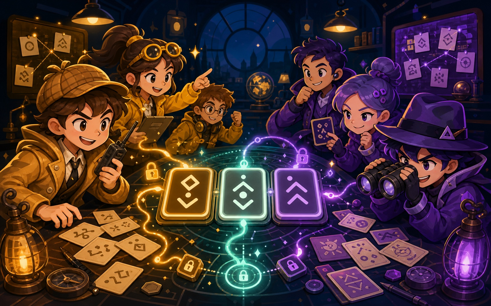

# 截码战 / Cipher Clash

一个可直接导入 [Parti](https://parti.linkai.work) 的 4–8 人联机文字对抗房间。两支队伍各自拥有四个私密关键词；编码员通过三个线索传递不重复的三位代码，队友负责解读，敌队同时尝试截获。

> 这是一个非官方、非商业的数字化实现，使用原创界面、关键词和代码。`Decrypto` 是其各自权利人的商标；本项目不隶属或获其认可。



## 立即游玩

1. 打开 [Parti](https://parti.linkai.work)。
2. 选择“从 GitHub 导入”，输入本仓库地址，或下载 Release 中的 `parti.room.zip` 后从 ZIP 导入。
3. 创建私密房间，邀请 3–7 位朋友。
4. 每队选择 2–4 位玩家；房主点击“开始截码战”。

联机房间由房主浏览器的 Worker 权威运行。朋友只需打开邀请链接，无需下载本仓库；房主关闭房间后，本局结束，但已安装的房间模板可随时重新创建。

## 文件结构

```text
parti-decrypto/
├── parti.room.json        # Parti manifest
├── assets/
│   ├── cipher-clash-cover.jpg  # 市场卡片与仓库首页封面
│   ├── amber-scout.png         # 琥珀队原创角色贴图
│   ├── violet-scout.png        # 紫罗兰队原创角色贴图
│   ├── cipher-cards.png        # 原创密码牌贴图
│   ├── gameboard-mat.jpg       # 静态任务垫背景
│   ├── signal-route.png        # 双队传讯线路贴图
│   └── secret-seal.png          # 私钥印章贴图
├── index.html             # 响应式客户端 UI
├── room.worker.js         # Worker 权威游戏逻辑
├── AGENTS.md              # 后续 AI/开发者维护说明
├── docs/
│   ├── DESIGN.md          # 玩法与架构设计记录
│   ├── PROJECT_MEMORY.md  # 重要约束、决策和待办
│   ├── VALIDATION.md      # 发布前验证清单
│   └── PUBLISHING.md      # Parti 市场发布与更新流程
└── LICENSE
```

## 规则摘要

- 4–8 位玩家，分为琥珀队与紫罗兰队，每队 2–4 人。
- 当前编码员私下获得一个由 1–4 构成、且不重复的三位代码。
- 编码员依次提交三条不含数字的线索；三条完成前不会公开。
- 本队非编码员提交解码，敌队提交截获猜测；两边均提交后才揭晓。
- 编码与猜测阶段分别显示 90 秒与 60 秒的建议倒计时；计时结束只会提示，绝不会自动结算当前环节。
- 一支队伍累计两次误码，敌队获胜；一支队伍累计两次截获，也立即获胜。
- Worker 内置 24 组不重复代码牌；极端情况下全部用尽时，按截获数、再按更少误码判定胜者。

## 开发与维护

此房间没有构建依赖。修改后可在 Parti 中重新导入，或使用 Parti 源仓库的本地开发 Harness 预览。

界面以“桌游侦报码任务台”为视觉方向：静态任务垫作为全局背景，封面和两名阵营侦报码角色帮助选队；进入对局后，角色缩入战况卡，传讯线路、密码牌和私钥印章成为视觉锚点。所有贴图都随本仓库分发，加载时不需要网络权限。为保护低功耗设备，界面不运行无限装饰动画；倒计时只更新一个文本节点，并在后台标签页暂停。

开始修改前请依次阅读：

1. [AGENTS.md](./AGENTS.md)
2. [设计记录](./docs/DESIGN.md)
3. [项目记忆](./docs/PROJECT_MEMORY.md)
4. [验证清单](./docs/VALIDATION.md)

## 许可证

本仓库中原创代码采用 [MIT License](./LICENSE)。Parti Runtime 本身采用独立许可证；使用或部署 Parti 时，请同时遵守其许可证与房间开发文档。
